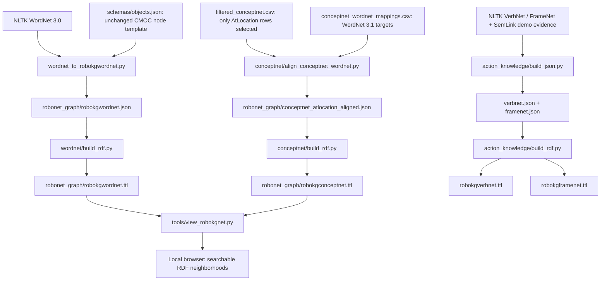

# RoboKGNet status

The current repository builds **four separate RDF resources** through deterministic
JSON intermediates. It does not yet implement semantic-memory learning or connect
these resources to executable planning.

## How the artifacts connect



There is deliberately **no identity link between WordNet 3.0 and 3.1** in this
pipeline. Loading both TTL files into one viewer is a read-only RDF union, not
an alignment, inference step, or change to either graph.

## What exists now

### WordNet backbone

- The canonical JSON is `robokgwordnet.json`: **29,581 object types** below
  `object.n.01`, with unchanged noun scope and no verb branch.
- `wordnet_to_robokgwordnet.py` combines a supplied schema and arbitrary WordNet
  root. The demo schema is an unchanged copy of CMOC `schemas/objects.json`.
- Nodes have canonical `id`, lexical `type`, `alternative_names`, direct
  `superclass` lists (multiple inheritance preserved), and null quality templates.
- The schema's numeric/array qualities do not allow null in actual observations;
  this is intentionally a schema-shaped template, not a fully validated instance.
- JSON: **11,815,636 bytes**. Minimal generated Turtle: **84,063 triples**,
  **4,473,718 bytes**. No rdf:type, duplicate synsetId, or partOfSpeech metadata.
- WordNet reader adaptations preserve viewer/interface access without changing
  ConceptNet, FrameNet, VerbNet, planning, or learned-memory content.

### ConceptNet AtLocation backbone

- Source CSV retains AtLocation, IsA, and UsedFor; the exporter reads only
  **261 AtLocation rows**, all retained.
- Both endpoints retain their ConceptNet identities and all explicit mapping
  candidates. **127 distinct subject concepts**, **99 object concepts**;
  **57 ambiguous subjects**, **36 ambiguous objects**; no unmapped endpoints
  in the current source. These are concept counts per role, not row counts.
- Targets remain Princeton WordNet **3.1** URIs. They are not automatically
  verified synsets: some are lexical/phrase resources. No sense choice,
  cross-version conversion, or guessed mapping is made.
- RDF assertions link `rdf:subject`, `rdf:predicate`, and `rdf:object`; concepts
  link through `mapsToWordNet`. Source hashes retain provenance. Two source
  targets need backtick escaping in RDF; their original strings are preserved.
- **2,410 RDF triples**; JSON **166,903 bytes**, Turtle **302,999 bytes**.
  No weights, observation counts, or runtime updates exist yet.

### Other repository resources

| File/directory | Current responsibility |
| --- | --- |
| `wordnet_to_robokgwordnet.py` | Extract an arbitrary WordNet branch using the supplied schema template. |
| `wordnet/build_wordnet.py` | Retired entry point; prints migration instructions. |
| `wordnet/bring_alignment.json` | Historical bring alignment evidence; not used by the new WordNet object generator. |
| `wordnet/build_rdf.py` | Read WordNet JSON and serialize deterministic Turtle. |
| `conceptnet/align_conceptnet_wordnet.py` | Join exact ConceptNet endpoint IDs against the explicit mapping CSV. |
| `conceptnet/build_rdf.py` | Read aligned JSON and serialize assertion/mapping RDF. |
| `tools/view_robokgnet.py` | Read existing TTL files and serve a local, dependency-free browser interface. |
| `tests/test_wordnet.py` | Tiny-subtree tests for schema shape, lexical grounding, parents, nulls and deterministic JSON/RDF. |
| `tests/test_conceptnet.py` | Exact input/mapping preservation, ambiguity, missing mappings, duplicate rows and RDF reload. |
| `tests/test_viewer.py` | HTTP, search, inspection and bounded-neighborhood smoke test using a tiny graph. |
| `planning.py` | Separate RDFS prototype; no WordNet/ConceptNet connection. Its executable defaults point to absent `data/` inputs, and parts of population remain incomplete. |
| `bringup/` | Static action/predicate libraries, scene graphs, robot descriptions, task PDDL and evaluation resources. |
| `create_knowledgegraph.py` | Older source-preparation entry point; downloads NLTK corpora and invokes ConceptNet filtering. Not the current artifact build entry point. |
| `utils/conceptnet_utils.py` | Raw ConceptNet filtering and mapping extraction; defaults target ignored `sources/conceptnet/`, not the committed resource directory. |
| `resources.yaml` | SemLink URL reference, not an operational pipeline configuration. |
| `notes.md` | Curated architectural work intentionally deferred. |

## Demo VerbNet and FrameNet resources

`action_knowledge/build_json.py` reads NLTK VerbNet 2.1, FrameNet 1.7, WordNet
sense keys, and `action_knowledge/semlink_demo.json`; `build_rdf.py` reads those
JSON outputs and writes separate `robokgverbnet.ttl` and `robokgframenet.ttl`.

- `verbnet.json`: bring-11.3/search-35.2 scopes, 26 members, 7 roles, 10 direct
  frames, 40 predicate occurrences; 91,211 bytes. RDF: 2,071 triples, 230,658 bytes.
- `framenet.json`: Bringing/Scrutiny, 35 FEs, 80 lexical units, 6 member-level
  SemLink records; 39,394 bytes. RDF: 1,237 triples, 112,829 bytes.
- The bring member is declared in bring-11.3-1; that fact is retained without
  exporting a third class resource or pretending the member is direct in its parent.
- Existing WordNet/ConceptNet artifacts are unchanged. The viewer's modes still
  cover only those two artifacts, not the new action graphs.

See [action_knowledge/README.md](action_knowledge/README.md) for exact provenance,
structured RDF conventions, alignment limitations, and the focused tests.

## Exact setup, regeneration and tests

Run all commands from the repository root. Setup requires network access;
subsequent builds and viewing use local resources.

```bash
python3 -m venv .venv
.venv/bin/python -m pip install -r wordnet/requirements.txt
.venv/bin/python -m nltk.downloader -d .venv/nltk_data wordnet verbnet framenet_v17
```

Regenerate WordNet (corpus → JSON → Turtle):

```bash
NLTK_DATA="$PWD/.venv/nltk_data" .venv/bin/python -B wordnet_to_robokgwordnet.py --schema schemas/objects.json --root object.n.01 --output robonet_graph/robokgwordnet.json
.venv/bin/python -B wordnet/build_rdf.py
```

Regenerate ConceptNet (two CSVs → aligned JSON → Turtle):

```bash
.venv/bin/python -B conceptnet/align_conceptnet_wordnet.py
.venv/bin/python -B conceptnet/build_rdf.py
```

Regenerate demo action knowledge (corpora/evidence → JSON → separate TTL):

```bash
NLTK_DATA="$PWD/.venv/nltk_data" .venv/bin/python -B action_knowledge/build_json.py
.venv/bin/python -B action_knowledge/build_rdf.py
```

Run all tests:

```bash
NLTK_DATA="$PWD/.venv/nltk_data" .venv/bin/python -B -m unittest discover -s tests -v
```

Run just the viewer smoke test (no NLTK corpus needed):

```bash
.venv/bin/python -B -m unittest discover -s tests -p 'test_viewer.py' -v
```

## Browser exploration (semantic view by default)

Each command loads the requested existing artifacts, chooses an available
loopback port, prints the URL, and opens the default browser:

```bash
.venv/bin/python -B tools/view_robokgnet.py --graph wordnet
.venv/bin/python -B tools/view_robokgnet.py --graph conceptnet
.venv/bin/python -B tools/view_robokgnet.py --graph both
```

For a manually opened URL:

```bash
.venv/bin/python -B tools/view_robokgnet.py --graph both --no-browser --port 8765
```

The interface is embedded HTML/SVG/JavaScript served by Python's standard-library
HTTP server. It uses no CDN, build system, or frontend framework and writes no
artifact files. Keep the terminal running; Ctrl+C stops the server. On a remote
machine, forward the chosen localhost port to your browser machine.

Suggested walkthrough:

1. In ConceptNet or both mode, the default **Simplified semantic view** opens
   **book** with direct **AtLocation** edges to bed, floor, row, and stack.
   Search `book` to return there; exact labels automatically center the graph.
2. Use **Relations** to isolate AtLocation, mappings, or WordNet hierarchy.
   The default **Concept neighborhood** hides mappings until **Show WordNet
   mappings** is checked. Exclusive relation filters override that checkbox.
3. Switch **View** to **Raw RDF view** to inspect the assertion structure.
   Switch back to hide reification nodes and restore direct semantic edges.
4. Choose **Physical mug** to explore WordNet superclass
   edges, displayed as **is a**. Click a node for its exact URI and RDF
   properties; double-click to center its neighborhood.
5. Search supports readable labels, alternative lemmas, and URIs. Exact matches
   center automatically, preferring ConceptNet concepts; Enter selects the best
   partial match. Only 40 search results are shown at once.

No RDF is rewritten. Semantic AtLocation edges are derived from the assertion
subject/predicate/object fields; duplicate assertions share one displayed edge
with source assertion IDs retained in the response. WordNet mapping edges stay
optional and version-specific. Unlabeled external mapping targets cannot be
assigned verified human-readable synset names without importing more data.

### Practical limits

The full selected RDF graph is parsed and indexed in Python, so startup and
memory use grow with artifact size. The browser only receives one-hop
neighborhoods, at most **40 incident relation edges per page**. Previous/Next
exposes remaining edges; there is no silent full-graph sample. The radial layout
is intentionally simple, and labels can overlap on dense pages; pan/zoom or
navigate to another focus node. It is not a global force-layout visualization.

Literal properties and `rdf:type`/source links appear in the inspector, keeping
the diagram focused on relationships. Schema and provenance resources remain
searchable. The viewer does not infer missing triples, fetch external resources,
edit graphs, or merge WordNet versions. “Both” mode remains bounded exactly like
the individual modes. Read [notes.md](notes.md) before extending those behaviors.
